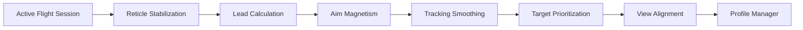

## Overview

Aces of Thunder Aim Assist is a specialized targeting control system designed to integrate with active **Aces of Thunder** sessions and refine how aiming logic is calculated during aerial combat. The system focuses on targeting assistance rather than global gameplay changes, exposing adjustable parameters related to reticle behavior, target prediction, and alignment smoothing. Typical use cases include stabilizing aim during high-speed maneuvers, improving lead calculation on moving targets, and reducing aim deviation caused by rapid aircraft motion. The assist operates through isolated session logic without modifying original game data.

---

## Reticle Stabilization Control 🎯

* Aim shake reduction
* Reticle drift compensation
* Dynamic stabilization scaling

**In-game behavior:**
Smooths reticle movement during aggressive maneuvers, helping maintain alignment with enemy aircraft.

---

## Target Lead Calculation Module ✈️

* Predictive lead adjustment
* Projectile travel-time compensation
* Speed-based scaling

**Feature intent:**
Refines how the system anticipates enemy movement, improving shot placement against fast or evasive targets.

---

## Aim Magnetism Adjustment 🧲

* Proximity-based aim attraction
* Soft-lock strength control
* Conditional activation rules

**In-game behavior:**
Gently guides aim toward valid targets when alignment is close, without forcing hard target locks.

---

## Tracking Smoothing Engine 🔄

* Horizontal and vertical smoothing
* Micro-correction filtering
* Responsiveness balance control

**Feature intent:**
Filters abrupt aim corrections to create more consistent tracking during sustained engagements.

---

## Target Prioritization Logic 👁️

* Closest-target weighting
* Threat-based priority rules
* Manual or automatic selection

**In-game behavior:**
Influences how potential targets are evaluated when multiple aircraft are within the aiming field.

---

## Scope & View Alignment Control 🔍

* Field-of-view alignment scaling
* Camera-to-reticle offset tuning
* Zoom-state specific profiles

**Feature intent:**
Ensures aim assistance remains consistent across different camera modes and zoom levels.

---

## Aim Assist Profile Manager 💾

* Multiple saved aim profiles
* Auto-load per aircraft or mission
* Version-aware configuration storage

**In-game behavior:**
Keeps aim assist behavior consistent across sessions while allowing quick switching between setups.

---

---

## FAQ

**Does aim assist work in real time during combat?**
Yes, adjustments are applied instantly during active flight sessions.

**Is the assist fully automatic?**
No, it provides guided correction rather than full target automation.

**Can aim assist be disabled per mission?**
Yes, profiles can be toggled or switched at any time.

**Does it affect weapon damage or accuracy stats?**
No, it only influences targeting logic and aim behavior.

**Are settings shared across aircraft types?**
Profiles can be global or aircraft-specific.

**Does this modify game files?**
No, all behavior is managed through in-session logic only.

---

## Feature Summary

* Reticle stabilization control
* Predictive target lead calculation
* Aim magnetism tuning
* Tracking smoothing logic
* Target prioritization handling
* View and scope alignment adjustment
* Persistent aim assist profiles

---
